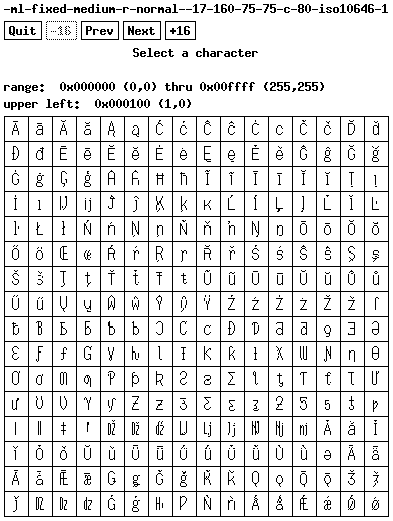

# Morning Light Font

Morning Light Font is an experimental generated font with machine learning.

All fonts included in the datasets are public domain X11 fonts,
misc fonts and Shinonome fonts. 

`FontMaskModel` is a Transformer-based masked vision model which predicts
masked tokens of the target font conditioned by the source fonts. The model
generates an 8x16 font with all characters included in the dataset.

Please note that this project is experimental. The generated font doesn't
have acceptable quality. Here is the comparison.

The generated 8x16 glyphs.



The original X11 8x13 glyphs.


## How to use

### Generate font with FontMaskModel.

Download the model file and save it as `fontmask-20260107.ckpt`.

```sh
python -m mlfont.cli predict \
    --ckpt_path fontmask-20260107.ckpt \
    --output ml8x16.txt
```

Display the result.

```sh
python -m mlfont.cli display \
    --input ml8x16.txt
```

Export the output as a BDF file.

```sh
python -m mlfont.cli makebdf \
    --input ml8x16.txt \
    --output ml8x16.bdf
```

## BDF font

Download generated BDF font [ml8x16.bdf](./ml8x16.bdf).